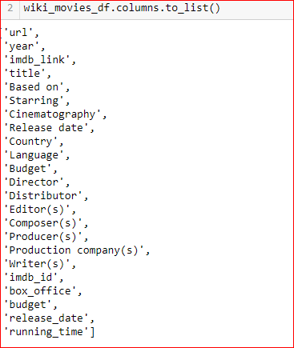

# Movies-ETL 
The purpose of this challenge to create ETL pipeline from raw data to SQL database. Extract the data using Python. Clean & transform the dta using the DataFrame. Use regex to parse the data & load to PostgreSQL

## ETL function to read the data:    

* Created function to read the Wikipedia , kaggle data, rating data. 

Raw Wikipedia data :

Raw Kaggle data :

Raw Ratings data :

## ETL for the Wikipedia data :  
* Loaded & converted the json file to DataFrame.
* By calling the clean_movie function, merged columns with of different languages to alternate title. Renamed the columns to appropiate headings.
* Removed the TV shows from the data.
* Created imbd_id & dropped the duplicate rows.
* Parsed the box-office, budget, running time & release date column using regex.
* After the ETL, the number of columns decreased to 23 from 193!

Cleaned Wikipedia Data :

Wikipedia Columns List:

## ETL for the Kaggle metadata data : 
* Loaded the dtaa into teh DataFrame.
* Parsed the data on columns:adult,video,budget,id,popularity & release date. 
* Merged the clean Wikipedia data & Kaggle data 
* Filled the missing kaggle data from the wiki data
* Renamed the columns in the merged data.
* Merged the rating data into the merged movie data.

Movie dataframe :

Movie data with Rating data merged

## Create Movie Database : 
* Created the movie database in pgAdmin4.
* Imported the dependency SQLACHEMY & psycopg2.
* Created the movie table in pgAdmin.

The movie  tables & the number of rows in the table:

* Created the rating tables in chunks as there were 260K rows.

* Top 10 rows of the rating table & number of rows:

