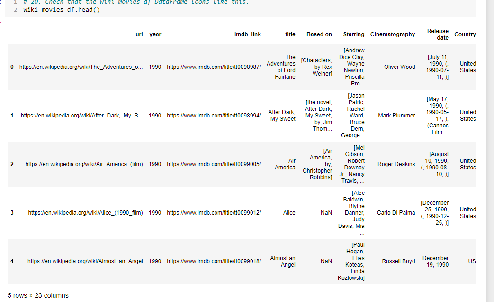

# Movies-ETL 
Created a movie database from multiple data sources.
Extracted the data from multiple data sources. Transformed multiple data using RegEX( dropping/merging columns) & created a DataFrame. Converted the DataFrame to create the movie database. Loaded the movie database to pgAdmin4. Wrote SQL query to verify the movie & rating tables in the database.

## ETL function to read three data files:    

* Wrote function to read the Wikipedia data ,kaggle data, and rating data. 

Raw Wikipedia data :

Raw Kaggle data :

Raw Ratings data :

## Extract and Transform the Wikipedia Data :  
* Loaded & converted the json file to DataFrame.
* By calling the clean_movie function, merged columns of different languages to alternate title. Renamed the columns to appropiate headings.
* Removed TV shows from the data.
* Created imbd_id & dropped duplicate rows.
* Parsed the box-office, budget, running time & release date column using RegEx.
* After the ET, the number of columns decreased to 23 from 193!

Cleaned Wikipedia Data :

Wikipedia Columns List:

## Extract and Transform the Kaggle data : 
* Loaded the data into the DataFrame.
* Parsed the data on adult, video, budget, id, popularity & release date columns.
* Merged the clean wWkipedia data & Kaggle data. 
* Filled the missing Kaggle data from the Wikipedia data & named the new DataFrame as 'movie'.
* Renamed the columns in the merged data.
* Merged the rating data into the merged movie data.

Movie DataFrame :

Movie data with Rating data merged

## Create Movie Database : 
* Created the movie database(movie_db) in pgAdmin4.
* Imported the dependency SQLACHEMY & psycopg2.
* Loaded the transformed data into movie database in pgAdmin4.
* Wrote query to verify the database.

The movie  tables & the number of rows in the table:

* Created the rating tables in chunks of 100,000 as there were 260K rows.

* Top 10 rows of the rating table & number of rows:

